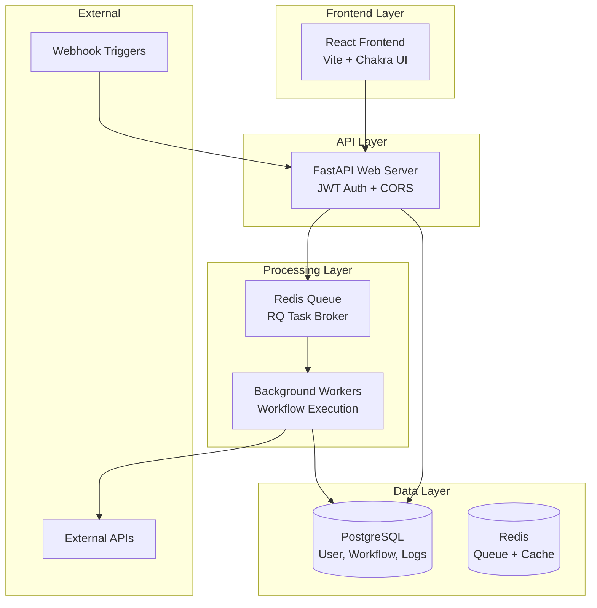
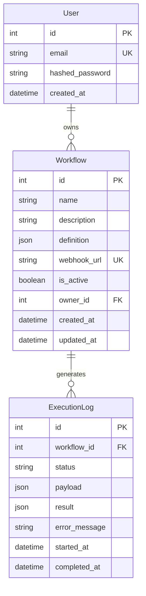
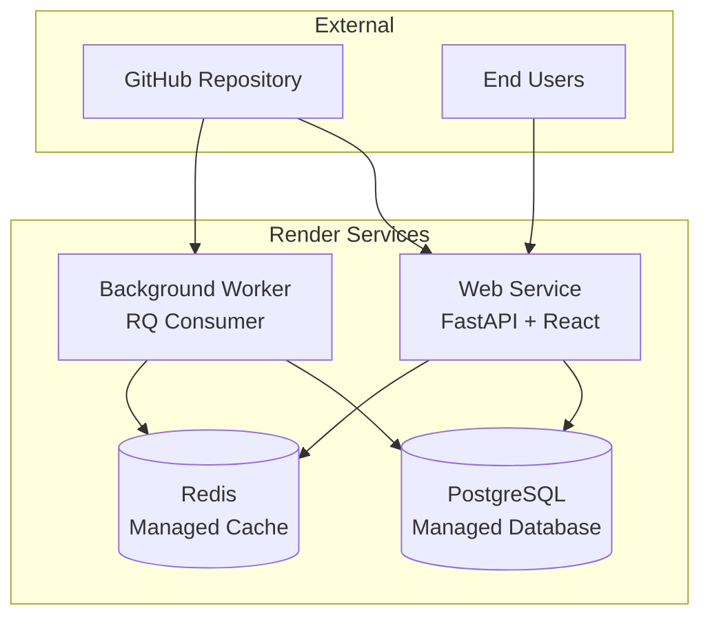

# Design Document

## Overview

AutomateOS is architected as a modern, event-driven workflow automation platform with strict separation between the web interface and execution engine. The system follows a microservices-inspired approach with API-based component architecture, enabling scalable, asynchronous processing of automation workflows.

The design prioritizes rapid development within a 4-week timeline while maintaining production-ready architecture patterns. The system uses a trigger-action model where external events initiate workflows that execute as background jobs, ensuring the main API remains responsive.

## Architecture

### High-Level Architecture



### API-Based Component Architecture

The system employs a clean API-first design where each component communicates through well-defined REST endpoints:

- **Authentication Service**: Handles user registration, login, and JWT token management
- **Workflow Service**: Manages CRUD operations for workflow definitions
- **Execution Service**: Processes webhook triggers and manages workflow execution
- **Logging Service**: Tracks and retrieves workflow execution history

### Technology Stack

**Backend Stack:**
- **FastAPI**: High-performance Python web framework with automatic OpenAPI documentation
- **SQLModel**: Unified data modeling combining Pydantic validation with SQLAlchemy ORM
- **PostgreSQL**: Production database with SQLite for local development
- **RQ + Redis**: Lightweight task queue for asynchronous workflow execution
- **JWT Authentication**: Token-based auth with passlib/bcrypt password hashing

**Frontend Stack:**
- **React 18**: Component-based UI with modern hooks and context
- **Vite**: Fast development server and optimized production builds
- **Chakra UI**: Comprehensive component library for rapid UI development
- **Axios**: HTTP client for API communication with interceptors for auth

## Components and Interfaces

### Core Data Models

```python
# User Model
class User(SQLModel, table=True):
    id: Optional[int] = Field(primary_key=True)
    email: str = Field(unique=True, index=True)
    hashed_password: str
    created_at: datetime
    workflows: List["Workflow"] = Relationship(back_populates="owner")

# Workflow Model  
class Workflow(SQLModel, table=True):
    id: Optional[int] = Field(primary_key=True)
    name: str
    description: Optional[str]
    definition: dict = Field(sa_column=Column(JSON))  # Node configuration
    webhook_url: str = Field(unique=True)
    is_active: bool = True
    owner_id: int = Field(foreign_key="user.id")
    created_at: datetime
    updated_at: datetime

# Execution Log Model
class ExecutionLog(SQLModel, table=True):
    id: Optional[int] = Field(primary_key=True)
    workflow_id: int = Field(foreign_key="workflow.id")
    status: str  # "success", "failed", "running"
    payload: dict = Field(sa_column=Column(JSON))
    result: Optional[dict] = Field(sa_column=Column(JSON))
    error_message: Optional[str]
    started_at: datetime
    completed_at: Optional[datetime]
```

### API Endpoints

**Authentication Endpoints:**
```
POST /api/v1/auth/register
POST /api/v1/auth/token
GET  /api/v1/users/me
```

**Workflow Management:**
```
GET    /api/v1/workflows          # List user workflows
POST   /api/v1/workflows          # Create workflow
GET    /api/v1/workflows/{id}     # Get workflow details
PUT    /api/v1/workflows/{id}     # Update workflow
DELETE /api/v1/workflows/{id}     # Delete workflow
```

**Execution & Monitoring:**
```
POST /api/v1/workflows/{id}/execute    # Webhook trigger
GET  /api/v1/workflows/{id}/logs       # Execution history
GET  /api/v1/logs/{execution_id}       # Detailed log
```

### Node Architecture

Workflows are composed of modular nodes with standardized interfaces:

```python
class NodeBase:
    def __init__(self, config: dict):
        self.config = config
    
    def execute(self, input_data: dict) -> dict:
        raise NotImplementedError

class WebhookTrigger(NodeBase):
    # Receives external HTTP requests
    pass

class HTTPRequestNode(NodeBase):
    # Makes HTTP calls to external APIs
    def execute(self, input_data: dict) -> dict:
        # Implementation for HTTP requests
        pass

class FilterNode(NodeBase):
    # Conditional logic for workflow branching
    def execute(self, input_data: dict) -> dict:
        # Implementation for filtering logic
        pass
```

### Frontend Component Structure

```
src/
├── components/
│   ├── auth/
│   │   ├── LoginForm.tsx
│   │   └── RegisterForm.tsx
│   ├── dashboard/
│   │   ├── WorkflowList.tsx
│   │   └── WorkflowCard.tsx
│   ├── editor/
│   │   ├── WorkflowEditor.tsx
│   │   ├── NodeSelector.tsx
│   │   └── nodes/
│   │       ├── WebhookNode.tsx
│   │       ├── HTTPRequestNode.tsx
│   │       └── FilterNode.tsx
│   └── common/
│       ├── Header.tsx
│       └── Layout.tsx
├── hooks/
│   ├── useAuth.ts
│   ├── useWorkflows.ts
│   └── useApi.ts
├── services/
│   └── api.ts
└── contexts/
    └── AuthContext.tsx
```

## Data Models

### Workflow Definition Schema

Workflows are stored as JSON objects with the following structure:

```json
{
  "nodes": [
    {
      "id": "trigger-1",
      "type": "webhook",
      "config": {
        "method": "POST",
        "path": "/webhook/abc123"
      }
    },
    {
      "id": "action-1", 
      "type": "http_request",
      "config": {
        "url": "https://api.example.com/data",
        "method": "POST",
        "headers": {"Content-Type": "application/json"},
        "body": "{{trigger.payload}}"
      }
    },
    {
      "id": "filter-1",
      "type": "filter", 
      "config": {
        "condition": "{{action-1.status}} == 200",
        "continue_on": true
      }
    }
  ],
  "connections": [
    {"from": "trigger-1", "to": "action-1"},
    {"from": "action-1", "to": "filter-1"}
  ]
}
```

### Database Schema Relationships



## Error Handling

### API Error Responses

Standardized error format across all endpoints:

```json
{
  "error": {
    "code": "VALIDATION_ERROR",
    "message": "Invalid workflow configuration",
    "details": {
      "field": "nodes[0].config.url",
      "issue": "Invalid URL format"
    }
  }
}
```

### Workflow Execution Error Handling

1. **Node Execution Failures**: Individual node failures are logged but don't crash the entire workflow
2. **Timeout Handling**: Long-running workflows have configurable timeouts
3. **Retry Logic**: Failed HTTP requests can be retried with exponential backoff
4. **Dead Letter Queue**: Failed jobs are moved to a separate queue for manual inspection

### Frontend Error Boundaries

React Error Boundaries wrap critical components to prevent UI crashes:

```tsx
<ErrorBoundary fallback={<ErrorFallback />}>
  <WorkflowEditor />
</ErrorBoundary>
```

## Testing Strategy

### Backend Testing

**Unit Tests (pytest):**
- Model validation and database operations
- Individual node execution logic
- Authentication and authorization flows
- API endpoint functionality

**Integration Tests:**
- End-to-end workflow execution
- Database transactions and rollbacks
- Redis queue operations
- External API mocking

### Frontend Testing

**Component Tests (React Testing Library):**
- Form validation and submission
- User interaction flows
- API integration with mocked responses
- State management and context providers

**E2E Tests (Playwright):**
- Complete user workflows from login to execution
- Cross-browser compatibility
- Mobile responsiveness

### Performance Testing

- Load testing webhook endpoints with concurrent requests
- Memory usage monitoring for long-running workflows
- Database query optimization and indexing
- Redis queue performance under high load

## Deployment Architecture

### Production Environment (Render)



### Environment Configuration

**Development:**
- SQLite database for rapid iteration
- Local Redis instance
- Hot reload for both frontend and backend

**Production:**
- PostgreSQL with connection pooling
- Redis with persistence enabled
- Horizontal scaling for worker processes
- Environment-based configuration management

### CI/CD Pipeline

1. **Code Push**: Developer pushes to GitHub main branch
2. **Automated Build**: Render detects changes and triggers build
3. **Frontend Build**: React app compiled to static assets
4. **Backend Deploy**: FastAPI service updated with zero downtime
5. **Worker Deploy**: Background workers restarted with new code
6. **Health Checks**: Automated verification of service availability

This design provides a solid foundation for rapid development while maintaining scalability and production readiness. The API-based architecture allows for independent development and testing of components, supporting your accelerated 4-week timeline.